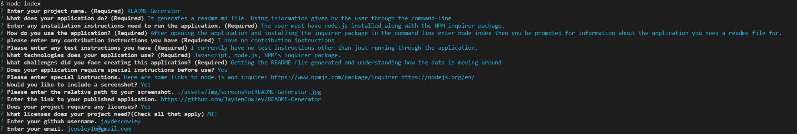

# README-Generator
  ## table of contents
  [Description](README.md/#description)  
  [Installation](README.md/#installation)  
  [Usage](README.md/#usage)  
  [License](README.md/#license)  
  [Contributing](README.md/#contribution)  
  [Questions](README.md/#questions)  
  ## License
  
  ## Description
  It generates a readme.md file. Using information given by the user through the command-line

  ### Installation Instructions
  The user must have node.js installed along with the NPM inquirer package. 
  
  ### Usage
  After opening the application and installing the inquirer package in the command line enter node index then you be prompted for information about the application you need a readme file for.

  ### Contribution
  I have no contribution instructions

  ### Test Instructions
  undefined

  ## Technologies
  Javascript, node.js, NPM’s inquirer package.

  ## Challenges
  Getting the README file generated and understanding how the data is moving around
  
  ## Special Instructions
  Here are some links to node.js and inquirer https://www.npmjs.com/package/inquirer https://nodejs.org/en/ 

  
  ## link to live application
  https://github.com/JaydenCowley/README-Generator 

  ## Questions
  [My Github account](https://github.com/jaydencowley)
  [Contact me via email](jcowley16@gmail.com)
